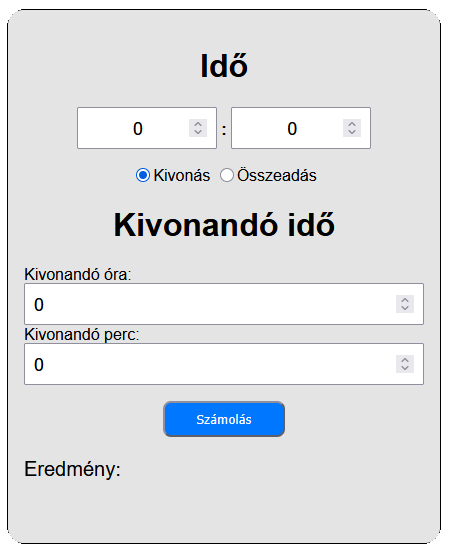

  <ul style="list-style: none;">
    

      <h1>Időszámoló</h1>
    

  </ul>

Ez egy egyszerű időszámoló webes eszköz, amely órát‑percet tud összeadni és kivonni.

  <ul style="list-style: none;">
    

      <h1>Kinézet</h1>
    

  </ul>

 <table align="center" width="100%">
  <tr>
    <td></td>
  <tr>
    <th width="500px">A program kinézete</th>
  </tr>
</table>

  <ul style="list-style: none;">
    

      <h1>Technológiák</h1>
    

  </ul>

<h3>Alap webes technológiák</h3>
<ul>
  <li>HTML</li>
  <li>CSS</li>
  <li>JavaScript</li>
</ul>

  <ul style="list-style: none;">
    

      <h1>Legutóbbi frissítések</h1>
    

  </ul>

<ul>
  <li>Példák a bal alsó sarokba</li>
</ul>

  <ul style="list-style: none;">
    

      <h1>Oldal elérése</h1>
    

  </ul>

Az oldal a következő linken érhető el: [https://csonti490.github.io/idoszamolo/](https://csonti490.github.io/idoszamolo/)

  <ul style="list-style: none;">
    

      <h1>Megjegyzés</h1>
    

  </ul>

Jelenlegi verzió: **1.00.01**  
Legutolsó frissítés dátuma: **2026.09.03.**

<table width="100%">
  <tr align="center">
    <td width="1000px" colspan="2">© 2025–2026 CsontiXD - All rights reserved.</td>
  </tr>
</table>

